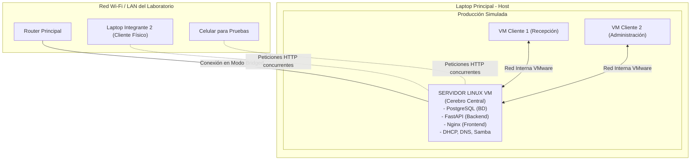

# Arquitectura de Despliegue y Dinámica de Pruebas

Este documento explica cómo el proyecto pasa de un entorno de "Desarrollo Local" a un entorno de "Producción Simulado", y cómo múltiples clientes (tanto virtuales como físicos) pueden conectarse simultáneamente al servidor para interactuar con la Base de Datos.

## 1. Diagrama de Conectividad (El Entorno Final)

Para cumplir con el PDF y además permitir que otros compañeros se conecten desde sus propias computadoras o celulares por la red LAN, la arquitectura en VMware debería estructurarse de la siguiente manera:

## 2. Explicación de la Dinámica (¿Cómo Funciona?)

1. **El Servidor Central (La VM Linux):** Es la única máquina que tendrá instalado **PostgreSQL** y el **código Python**. Estará escuchando peticiones las 24 horas del día.
2. **Los Clientes Virtuales (VMs internas):** Las máquinas virtuales de Recepción y Administración recibirán su IP automáticamente gracias al servicio `isc-dhcp-server` del Servidor.
3. **Conexión de Computadoras Externas:** Si configuras el adaptador de red de la Máquina Virtual del Servidor en modo **Adaptador Puente (Bridged)** en VMware, el servidor se conectará a la red Wi-Fi/LAN física.
   * Esto permitirá que cualquier otro integrante del grupo escriba la IP del servidor en su navegador web (desde otra laptop o incluso desde un celular) y vea la interfaz del hotel en tiempo real.

## 3. Manejo de Múltiples Peticiones (Concurrencia)

Al utilizar **FastAPI** (Backend) y **PostgreSQL** (Base de Datos), el sistema está diseñado para soportar múltiples usuarios al mismo tiempo (Multipeticiones):

* Si el Integrante 1 (desde la VM Cliente) y el Integrante 2 (desde su celular en la red LAN) intentan consultar la disponibilidad de las habitaciones al mismo segundo, **FastAPI (usando Uvicorn)** maneja estas conexiones de forma asíncrona.
* **PostgreSQL** posee un sistema de bloqueos transaccionales (ACID). Si dos recepcionistas intentan ocupar la habitación `102` exactamente al mismo tiempo, el motor de base de datos se encargará de encolar las peticiones para que la información no se corrompa, otorgándole la habitación al primero que llegó y devolviendo un error de "Ocupada" al segundo.

## 4. ⚠️ Advertencia Técnica para las Pruebas

Dado que el PDF te exige configurar un servidor **DHCP** en tu Servidor Linux:
* Si conectas tu Servidor Linux directamente a la red Wi-Fi de la universidad en modo Puente (Bridged), **tu servidor intentará darle direcciones IP a todas las computadoras de la universidad**, creando un conflicto con el Router principal (Falla conocida como *Rogue DHCP*).
* **Solución Segura:** El Servidor Linux debe tener **2 Tarjetas de Red (NICs)** en VMware:
  1. `NIC 1` (Modo NAT o Bridged): Para tener internet y permitir que tus compañeros entren a la web.
  2. `NIC 2` (Modo LAN Segment / Host-Only): Esta será la red `192.168.10.0/24`. El DHCP de tu servidor **SOLO** debe funcionar por esta segunda tarjeta para dar IP exclusivamente a tus Máquinas Virtuales cliente (Recepción y Admin), tal como pide la rúbrica del proyecto.
